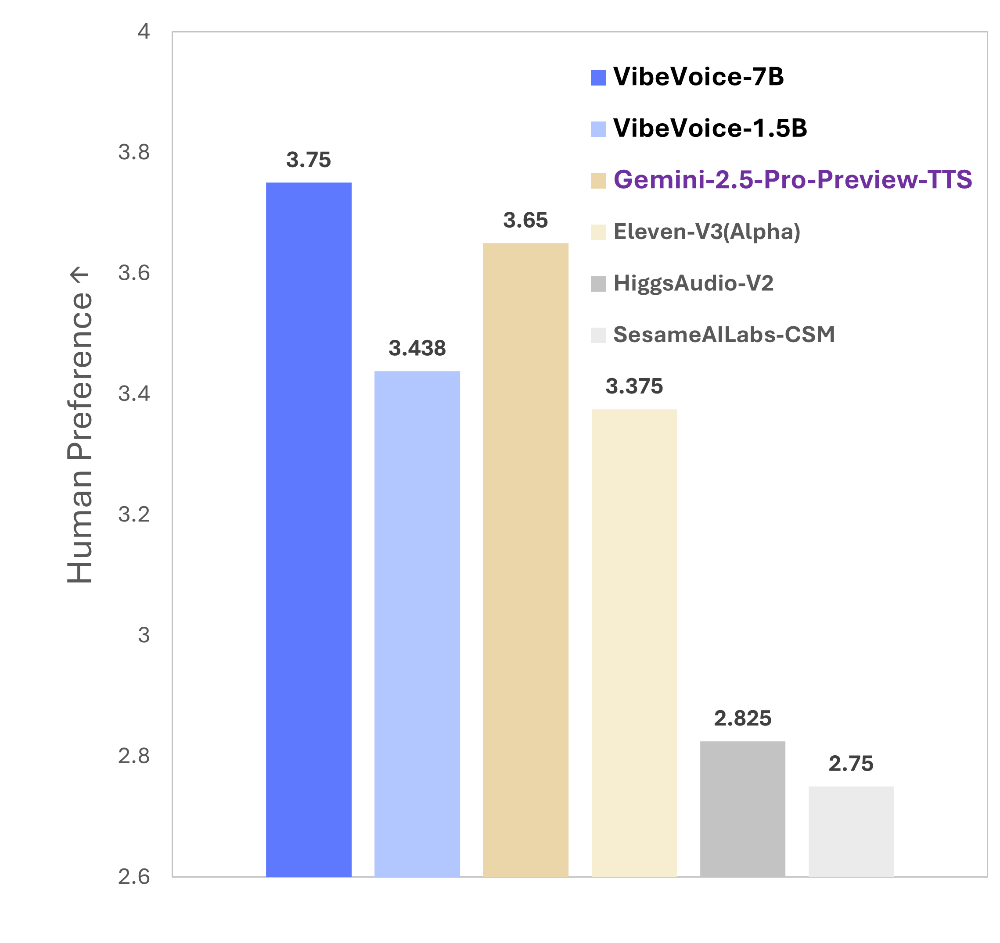
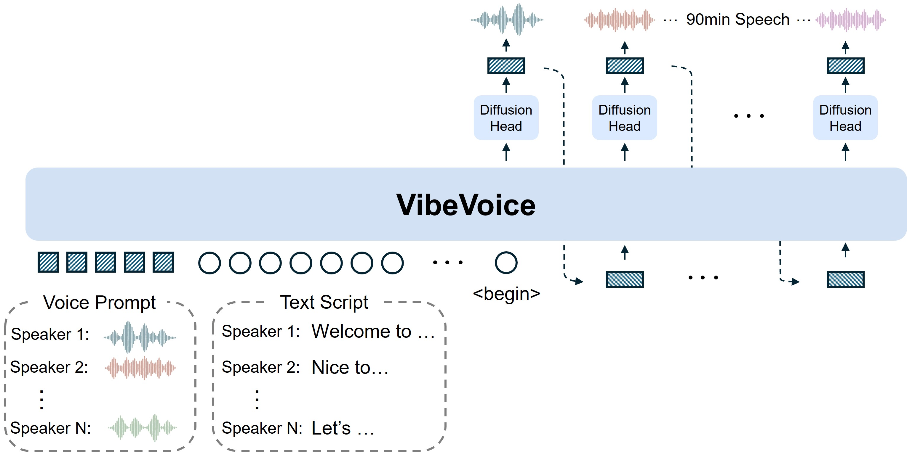

> [!IMPORTANT]
> This is a community-maintained fork of VibeVoice. Following the removal of the official VibeVoice repository, this fork serves to preserve the codebase and maintain accessibility for the community while also introducing additional functionality (such as unofficial training/fine-tuning implementations)

## 🎙️ VibeVoice: A Frontier Long Conversational Text-to-Speech Model

[](https://microsoft.github.io/VibeVoice)
[](https://huggingface.co/vibevoice)
[](https://arxiv.org/pdf/2508.19205)
[](https://colab.research.google.com/github/vibevoice-community/VibeVoice/blob/main/demo/VibeVoice_colab.ipynb)

## Community

**Join the unofficial Discord community: https://discord.gg/ZDEYTTRxWG** - share samples, ask questions, discuss fine-tuning, etc.

## Overview

VibeVoice is a novel framework designed for generating **expressive**, **long-form**, **multi-speaker** conversational audio, such as podcasts, from text. It addresses significant challenges in traditional Text-to-Speech (TTS) systems, particularly in scalability, speaker consistency, and natural turn-taking.

A core innovation of VibeVoice is its use of continuous speech tokenizers (Acoustic and Semantic) operating at an ultra-low frame rate of 7.5 Hz. These tokenizers efficiently preserve audio fidelity while significantly boosting computational efficiency for processing long sequences. VibeVoice employs a [next-token diffusion](https://arxiv.org/abs/2412.08635) framework, leveraging a Large Language Model (LLM) to understand textual context and dialogue flow, and a diffusion head to generate high-fidelity acoustic details.

The model can synthesize speech up to **90 minutes** long with up to **4 distinct speakers**, surpassing the typical 1-2 speaker limits of many prior models.

## [Examples](./EXAMPLES.md)

## Evaluation

<p align="left">
  
  
</p>


## Updates

- **[2025-09-05]** Microsoft repo restored (without code) with statement about responsible AI use.
- **[2025-09-04]** Community backup created after Microsoft removed original repo and models.
- **[2025-08-26]** The [VibeVoice-7B](https://huggingface.co/vibevoice/VibeVoice-7B) model weights are open-sourced!
- **[2025-08-28]** [Colab Notebook](https://colab.research.google.com/github/microsoft-community/VibeVoice/blob/main/demo/VibeVoice_colab.ipynb) available. Only VibeVoice-1.5B is supported due to GPU memory limitations.

## Roadmap

- [x] Unofficial/community training code
- [ ] HF Transformers integration ([PR](https://github.com/huggingface/transformers/pull/40546))
- [ ] VibePod: End-to-end solution that creates podcasts from documents, webpages, or even a simple topic.

## Model Zoo

| Model | Context Length | Generation Length |  Weight |
|-------|----------------|----------|----------|
| VibeVoice-1.5B | 64K | ~90 min | [HF link](https://huggingface.co/vibevoice/VibeVoice-1.5B) |
| VibeVoice-Large| 32K | ~45 min | [HF link](https://huggingface.co/vibevoice/VibeVoice-7B) |

## Installation

```bash
git clone https://github.com/vibevoice-community/VibeVoice.git
cd VibeVoice/

uv pip install -e .
```

## Usage

### OpenAI-compatible Audio API (local server)

Run a local server that is compatible with the openai-python audio API (`client.audio.speech.create`). It wraps VibeVoice to synthesize speech from text.

Start the server:

```bash
python -m vibevoice_api.server --model_path vibevoice/VibeVoice-1.5B --port 8000
```

#### API base path (`/v1` default)

All routes are mounted on `/v1` by default. Override the prefix before launching the server by setting `VIBEVOICE_API_BASE_PATH` (leading slash required):

```bash
export VIBEVOICE_API_BASE_PATH=/api
python -m vibevoice_api.server --model_path vibevoice/VibeVoice-1.5B --port 8000
```

Clients must include the same prefix when constructing URLs:

```python
base_path = "/api"  # matches VIBEVOICE_API_BASE_PATH
client = OpenAI(base_url=f"http://127.0.0.1:8000{base_path}", api_key="<YOUR_API_KEY>")
```

The static console is served at `<base_path>/web/console.html`. Legacy root routes (e.g., `/audio/speech`, `/metrics`) remain for backwards compatibility, but new integrations should prefer the explicit prefix.

Then test with either the official openai client (pip) or a pure-HTTP script.

Option A — official openai (pip install openai ≥ 1.40):

```python
from openai import OpenAI
client = OpenAI(
    base_url="http://127.0.0.1:8000/v1",  # adjust if VIBEVOICE_API_BASE_PATH changes
    api_key="<YOUR_API_KEY>",
)

speech = client.audio.speech.create(
    model="vibevoice/VibeVoice-1.5B",  # or local path
    voice="Andrew",                     # mapped to demo/voices/*.wav
    input="Hello from VibeVoice!",
    response_format="mp3",              # wav/pcm (native) or mp3/opus/aac (ffmpeg; flac removed)
)

with open("out.wav", "wb") as f:
    f.write(speech.read())
```

> ℹ️ **Tip:** `mp3`, `opus`, and `aac` responses require a working ffmpeg binary (set `VIBEVOICE_FFMPEG` or ensure `ffmpeg` is on
> PATH). When ffmpeg is unavailable the server will raise a clear error; `wav`/`pcm` continue to work without it.

Option B — pure HTTP script (no openai dependency):

```bash
python scripts/api_audio_speech_test.py \
  --base_url http://127.0.0.1:8000 \
  --model_path "F:/VibeVoice-Large" \
  --voice alloy \
  --response_format mp3 \
  --out outputs/api_http/out.mp3
```

Notes:
- Base URL: if you override `VIBEVOICE_API_BASE_PATH`, point clients (`base_url`, `--base_url`, browser tabs) to the same prefix (e.g., `http://127.0.0.1:8000/api`).
- Formats: `wav` and `pcm` are native. `mp3`, `opus`, `aac` require ffmpeg. Set `VIBEVOICE_FFMPEG` to the binary path or ensure `ffmpeg` is in PATH. (flac removed)
- `voice` handling:
  - Name mapping to `demo/voices/*.wav` (best-effort; falls back to first voice).
  - Optional YAML mapping: create `voice_map.yaml` (or set `VIBEVOICE_VOICE_MAP=path/to/voice_map.yaml`) to alias names to existing samples or custom files.
    Example:
    
    ```yaml
    # voice_map.yaml
    alloy: en-Frank_man        # map to scanned name
    ash: demo/voices/en-Carter_man.wav  # map to explicit path
    aliases:
      shimmer: en-Alice_woman
    ```
  - SSE streaming: set `stream_format="sse"` to receive SSE events with base64-encoded PCM chunks.
  - Absolute/relative file path also works: set `voice="path:/abs/or/relative.wav"` or just `voice="/abs/or/relative.wav"`.
  - Data URL or base64 upload works via `extra_body`:

```python
voice_bytes = open("my_ref.wav","rb").read()
import base64
voice_b64 = base64.b64encode(voice_bytes).decode()

speech = client.audio.speech.create(
    model="vibevoice/VibeVoice-1.5B",
    voice="Andrew",  # used only if no voice_data/voice_path are passed
    input="Hello!",
    response_format="mp3",
    extra_body={
        # either absolute/relative path
        # "voice_path": "./my_ref.wav",
        # or base64 (optionally as a data URL: f"data:audio/wav;base64,{voice_b64}")
        "voice_data": voice_b64,
    },
)
```

- STT endpoints are not provided; only `audio.speech` is implemented.
- Device: CUDA if available; override with `VIBEVOICE_DEVICE=cpu|cuda|mps`.
- Local model path tips:
  - If you pass a local `--model_path`, ensure all shards referenced by `model.safetensors.index.json` are present in that folder (e.g., `model-00001-of-00010.safetensors` ... `model-00010-of-00010.safetensors`). The server now validates these and returns a clear 400 error if any are missing.
  - You can disable the shard pre-check by setting `VIBEVOICE_VALIDATE_SHARDS=0`. Note: if shards are truly missing, the underlying loader may still fail.

Auth & Logging:
- API key auth is disabled by default. To enable, set `VIBEVOICE_REQUIRE_API_KEY=1` and manage keys externally.
- Logs are written to `logs/`:
  - `requests.log` (JSONL; includes request id, prompt snippet if enabled)
  - `hints.log` (JSONL; internal hints per request)
  - Configure via env: `VIBEVOICE_LOG_DIR`, `VIBEVOICE_LOG_PROMPTS=1`, `VIBEVOICE_PROMPT_MAXLEN=4096`.
- Admin API key management (requires `VIBEVOICE_ADMIN_TOKEN`):
  1. Export a secret token before launching the server, e.g. `export VIBEVOICE_ADMIN_TOKEN="super-secret"`. If unset the admin routes return `403 admin_disabled`.
  2. Call the admin endpoints (respecting your base path, `/v1` by default) with an `Authorization: Bearer $VIBEVOICE_ADMIN_TOKEN` header:

     ```bash
     # List stored key hashes
     curl -sS -H "Authorization: Bearer $VIBEVOICE_ADMIN_TOKEN" \
       http://127.0.0.1:8000/v1/admin/keys

     # Create/import a key (omit the body to auto-generate with the given prefix)
     curl -sS -X POST -H "Authorization: Bearer $VIBEVOICE_ADMIN_TOKEN" \
       -H "Content-Type: application/json" \
       -d '{"prefix": "sk-"}' \
       http://127.0.0.1:8000/v1/admin/keys

     # Revoke a key by its stored hash
     curl -sS -X DELETE -H "Authorization: Bearer $VIBEVOICE_ADMIN_TOKEN" \
       http://127.0.0.1:8000/v1/admin/keys/<key_hash>
     ```

  3. `GET` responds with `{"keys": [...], "count": N}`; `POST` returns the plaintext `key` (only shown once) plus its `hash` (SHA-256); `DELETE` returns `{"deleted": true, "hash": ...}` or a `404` for unknown hashes. You can supply an existing key with `{"key": "sk-..."}` or omit the body to let the server generate one (optionally customise the prefix).
  4. These admin routes bypass the regular API-key middleware so you can manage keys even when `VIBEVOICE_REQUIRE_API_KEY=1`, but they are still observed/logged and reply with clear `401`/`403` errors if the admin bearer token is missing or incorrect.

### 🚨 Tips

We observed users may encounter occasional instability when synthesizing Chinese speech. We recommend:

- Using English punctuation even for Chinese text, preferably only commas and periods.
- Using the Large model variant, which is considerably more stable.
- If you found the generated voice speak too fast. Please try to chunk your text with multiple speaker turns with same speaker label.

We'd like to thank [PsiPi](https://huggingface.co/PsiPi) for sharing an interesting way for emotion control. Details can be found via [discussion #12](https://huggingface.co/microsoft/VibeVoice-1.5B/discussions/12).

**Option 1: Launch Gradio demo**

```bash
python demo/gradio_demo.py --model_path vibevoice/VibeVoice-1.5B --share
# or python demo/gradio_demo.py --model_path vibevoice/VibeVoice-7B --share
```

**Option 2: Inference from files directly**

```bash
# We provide some LLM generated example scripts under demo/text_examples/ for demo
# 1 speaker
python demo/inference_from_file.py --model_path vibevoice/VibeVoice-7B --txt_path demo/text_examples/1p_abs.txt --speaker_names Alice

# or more speakers
python demo/inference_from_file.py --model_path vibevoice/VibeVoice-7B --txt_path demo/text_examples/2p_music.txt --speaker_names Alice Frank
```


## [Finetuning](./FINETUNING.md)

NOTE: Finetuning is still **very experimental** and not well tested yet!

## FAQ

#### Q1: Is this a pretrained model?
**A:** Yes, it's a pretrained model without any post-training or benchmark-specific optimizations. In a way, this makes VibeVoice very versatile and fun to use.

#### Q2: Randomly trigger Sounds / Music / BGM.
**A:** As you can see from our demo page, the background music or sounds are spontaneous. This means we can't directly control whether they are generated or not. The model is content-aware, and these sounds are triggered based on the input text and the chosen voice prompt.

Here are a few things we've noticed:
*   If the voice prompt you use contains background music, the generated speech is more likely to have it as well. (The Large model is quite stable and effective at this—give it a try on the demo!)
*   If the voice prompt is clean (no BGM), but the input text includes introductory words or phrases like "Welcome to," "Hello," or "However," background music might still appear.
*   Speaker voice related, using "Alice" results in random BGM than others (fixed).
*   In other scenarios, the Large model is more stable and has a lower probability of generating unexpected background music.

In fact, we intentionally decided not to denoise our training data because we think it's an interesting feature for BGM to show up at just the right moment. You can think of it as a little easter egg we left for you.

#### Q3: Text normalization?
**A:** We don't perform any text normalization during training or inference. Our philosophy is that a large language model should be able to handle complex user inputs on its own. However, due to the nature of the training data, you might still run into some corner cases.

#### Q4: Singing Capability.
**A:** Our training data **doesn't contain any music data**. The ability to sing is an emergent capability of the model (which is why it might sound off-key, even on a famous song like 'See You Again'). (The Large model is more likely to exhibit this than the 1.5B).

#### Q5: Some Chinese pronunciation errors.
**A:** The volume of Chinese data in our training set is significantly smaller than the English data. Additionally, certain special characters (e.g., Chinese quotation marks) may occasionally cause pronunciation issues.

#### Q6: Instability of cross-lingual transfer.
**A:** The model does exhibit strong cross-lingual transfer capabilities, including the preservation of accents, but its performance can be unstable. This is an emergent ability of the model that we have not specifically optimized. It's possible that a satisfactory result can be achieved through repeated sampling.

## Credits

- Thanks to [Microsoft](https://github.com/microsoft/VibeVoice) for the original VibeVoice implementation.
- Huge shoutout to [Juan Pablo Gallego](https://github.com/jpgallegoar) from [VoicePowered AI](https://www.voicepowered.ai/) for the unofficial training/fine-tuning code.
- Thanks to [PsiPi](https://huggingface.co/PsiPi) for sharing an interesting way for emotion control. Details can be found via [discussion #12](https://huggingface.co/microsoft/VibeVoice-1.5B/discussions/12).

## License

The source code and models are licensed under the MIT License. See the [LICENSE](./LICENSE) file for details.

Note: Microsoft has removed the original repo and models. This fork is based off of the MIT-licensed code from Microsoft.
### JS SSE client (Node 18+)

```bash
node scripts/js/openai_sse_client.mjs \
  --base http://127.0.0.1:8000 \
  --model "F:/VibeVoice-Large" \
  --voice Alice \
  --text "Hello SSE" \
  --out outputs/js_sse/out.wav
```

This client posts to `/audio/speech` with `stream_format="sse"`, parses SSE events, decodes base64 PCM chunks, and writes a WAV file.
### Voice Mapping via YAML

You can manage voice name aliases via a simple YAML file. The server loads it on each request:

- Search order (first found):
  1) `VIBEVOICE_VOICE_MAP` env var (relative to repo root or absolute)
  2) `<repo>/voice_map.yaml`
  3) `<repo>/config/voice_map.yaml`

Copy the sample and edit:

```bash
cp config/voice_map.yaml.sample config/voice_map.yaml
```

Example mapping:

```yaml
# voice_map.yaml
alloy: en-Frank_man
ash: en-Carter_man

aliases:
  promo_female: demo/voices/en-Alice_woman.wav
  win_custom: F:\\voices\\my_voice.wav
```

Then call with `voice="alloy"` (or any alias you created). Changes are picked up on next request.

If you prefer an explicit path per request, keep using `extra_body.voice_path` or `extra_body.voice_data`.

See also: `config/voice_map.yaml.sample` for a comprehensive example.
